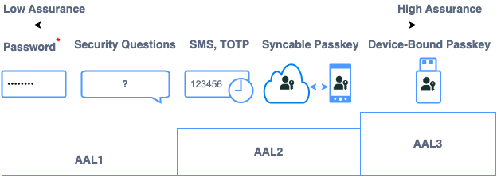

## High Assurance Passkeys: Best Practices and Considerations

Individuals with high visibility and access to sensitive information are prime targets for online attacks. This group encompasses a wide range of people, including journalists, human rights activists, business executives, election officials and candidates, diplomats and government officials, as well as celebrities and public figures. They are looking for services that offer high assurance protections for their identity and assets. High assurance passkeys in conjunction with advanced protection services offer a powerful solution to fortify security and protect against various threats. 

## Understanding Assurance Levels



The [NIST Special Publication 800-63](https://pages.nist.gov/800-63-3/) provides guidelines for digital identity authentication. Part of these guidelines includes defining Authenticator Assurance Levels (AALs) to categorize the strength of authentication methods.

There are three levels of AALs defined:
- **AAL1 (Low Phishing Resistance):** This level requires evidence of possession and control of a unique authenticator, such as a password or PIN. It's the lowest level of assurance and is typically used for low-risk applications where the consequences of unauthorized access are minimal.
- **AAL2 (Phishing Resistance Varies):** AAL2 requires evidence of possession and control of two different authentication factors. These factors could include something the user knows (e.g., a password) and something the user has (e.g., a cryptographic key). A phishable example would be SMS one time passcode. An phishing resistant example would be [syncable passkeys](https://www.nist.gov/blogs/cybersecurity-insights/giving-nist-digital-identity-guidelines-boost-supplement-incorporating) as defined by [NIST SP 800-63Bsup1](https://doi.org/10.6028/NIST.SP.800-63Bsup1). 
- **AAL3 (Phishing Resistant MFA):** AAL3 requires evidence of possession and control of two different authentication factors through a cryptographic protocol, plus additional attributes such as the use of a hardware-based authenticator and verifier impersonation resistance. An example would be a device-bound passkey. It provides the highest level of assurance and is recommended for high-risk applications where the consequences of unauthorized access are significant.

Assurance levels provide a framework for assessing the strength of authentication methods based on the number and type of factors required for authentication, with higher levels corresponding to greater assurance of security.

## Key Components of High Assurance Passkeys

1. **Attestation and Metadata:** High assurance passkeys provide attestation to verify the authenticity and integrity of the authenticator. The [FIDO Alliance MetaData Service](https://fidoalliance.org/metadata/) provides a mechanism to validate FIDO2 certified authenticator attestations and prove the genuineness of the device model and its attributes.
1. **AAL3 Multi-Factor Authentication (MFA):** High assurance passkeys require multiple factors from an authenticator that protects the key material within a hardware-backed secure element.
1. **Device-Bound Credentials:** High assurance passkeys are bound to a single device, such as a security key. This device binding ensures that the private key associated with the passkey is securely stored and cannot be copied or transferred to other devices.

## Best Practices for Implementation

1. **Risk Assessment:** Conduct a thorough risk assessment to identify the specific security requirements and threats relevant to your organization and applications. This will help determine the appropriate level of assurance needed for your passkey implementation. Offering the option for high assurance passkeys may be a deciding factor for high visibility users.
1. **Selecting Authenticators:** Choose trusted authenticators that meet the criteria for high assurance, such as FIDO Alliance MDS certified authenticators that protect private keys in a hardware-backed secure element. Consider factors such as platform compatibility, browser compatibility, user experience, and regulatory compliance.
1. **Enforcement of MFA:** 
    1. Require user verification in the public key credential creation options and set the credential protection policy to mandate user verification in the extensions.

    ```js
    navigator.credentials.create({
        publicKey: {
            rp: {...},
            user: {...},
            challenge: ...,
            pubKeyCredParams: [...],
            excludeCredentials: [...],
            attestation: "direct",
            authenticatorSelection: {
                residentKey: "required",
                userVerification: "required"
            },
            extensions: {
                credProps: true,
                credentialProtectionPolicy: "userVerificationRequired",
                enforceCredentialProtectionPolicy: true
            }
        }
    })
    ```

    If the relying party accepts a wide range of authenticator assurance levels, then user verification may be set to `preferred`. In this case the relying party should include the authenticator assurance level in risk assessments.

    2. Relying Party always verifies the user verification (UV) flag is true in authenticator response. See the following example extracted information from authenticator data.

    ```js
    {
        aaguid: {...},
        attestationFmt: ...,
        attestationObject: ...,
        createdAt: ...,
        credentialId: ...,
        device: {...},
        largeBlob: ...,
        publicKeyAlgorithm: ...,
        registrationData: {
            authenticatorData: ...,
            clientExtensionResults: {...},
            flags: {
                AT: true,
                ED: true,
                UP: true,
                UV: true
            },
            signatureCounter: ...
        },
        residentKey: true
    }
    ```

    If the relying party accepts various authenticator assurance levels, it's crucial to consider the UV flag in conjunction with other authentication factors when assessing risk.

1. **Attestation and Metadata Handling:** Verify authenticator attestation
    1. Request `direct` attestation during passkey creation 

    ```js
    navigator.credentials.create({
        publicKey: {
            rp: {...},
            user: {...},
            challenge: ...,
            pubKeyCredParams: [...],
            excludeCredentials: [...],
            attestation: "direct",
            authenticatorSelection: {
                residentKey: "required",
                userVerification: "required"
            },
            extensions: {
                credProps: true,
                credentialProtectionPolicy: "userVerificationRequired",
                enforceCredentialProtectionPolicy: true
            }
        }
    })
    ```

    2. Leverage the FIDO Alliance Metadata Service (MDS) to verify the authenticator’s attestation and that the authenticator attributes meet your high assurance requirements, such as key protection attributes including `hardware` and `secure-element`. See the following example metadata service object snippet.

    ```js
    {
        attestationCertificateKeyIdentifiers: [...],
        metadataStatement: {
            legalHeader: ...,
            attestationCertificateKeyIdentifiers: [...],
            description: ...,
            authenticatorVersion: ...,
            protocolFamily: ...,
            schema: ...,
            upv: [...],
            authenticationAlgorithms: [...],
            publicKeyAlgAndEncodings: [...],
            attestationTypes: [...],
            userVerificationDetails: [...],
            keyProtection: [
                "hardware",
                "secure_element",
                "remote_handle"
            ],
            matcherProtection: [...],
            cryptoStrength: ...,
            attachmentHint: [...],
            tcDisplay: [],
            attestationRootCertificates: [...],
            icon: ...
        },
        statusReports: [...],
        timeOfLastStatusChange: ...
    }
    ```

    3. Record in your credential repository the status as to whether the authenticator’s attestation was verified and its attributes satisfied your high assurance requirements. Optionally, record the authenticator’s registration attestation statement. 
1. **User Education and Training:** Educate users about the importance of high assurance passkeys and instructions on how to securely register and authenticate with passkeys. When high assurance authentication is used then attackers target account recovery options. Accounts are only as secure as their lowest assurance recovery option. Provide training on how to securely manage device-bound credentials, use authenticators, and recognize potential security threats. 
1. **Continuous Monitoring and Updates:** Regularly monitor the performance and security of the passkey implementation, including the FIDO Alliance MDS to ensure you have the latest information about new authenticators and remediate against vulnerabilities discovered in trusted authenticators.