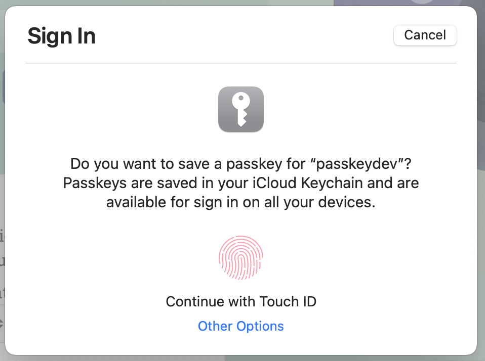
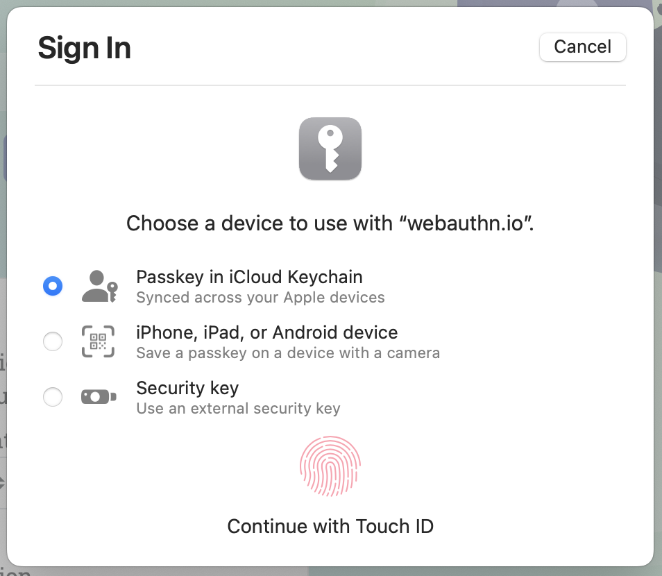
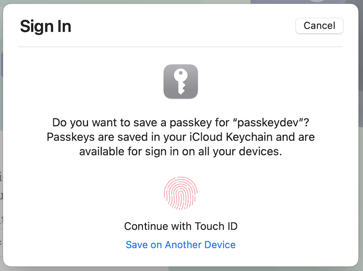
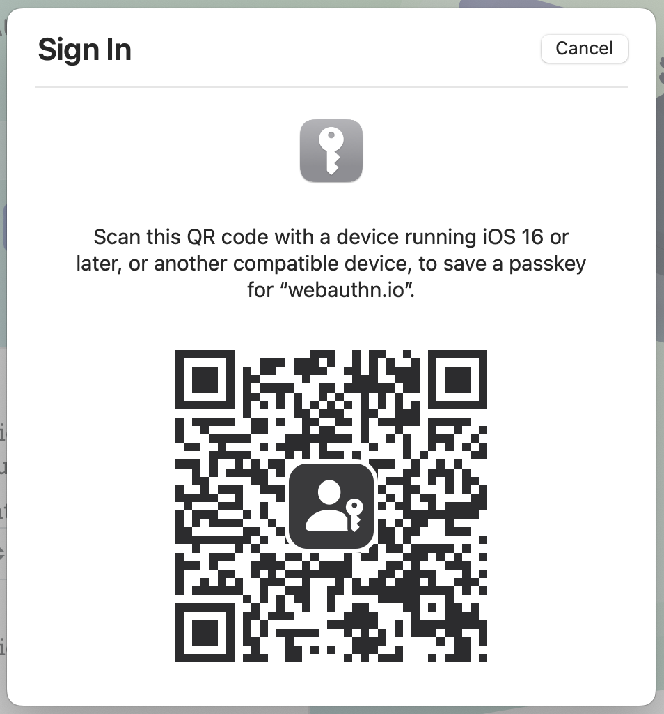
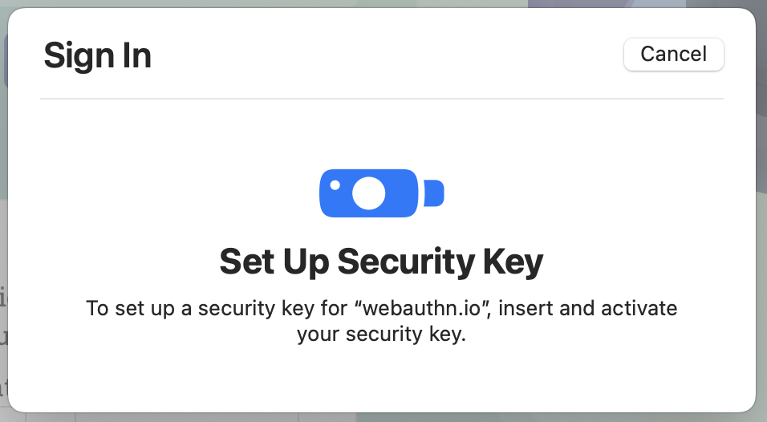

{}

## Overview

The platform authenticator in macOS Ventura (13) has the following capabilities:

- creating and using passkeys that are backed up to iCloud Keychain
- creating and using passkeys on/from another device, such as:
  - an iPhone or iPad signed in to a different iCloud account
  - a FIDO2 security key

## Platform Notes

### Legacy Credentials

WebAuthn credentials created using the platform authenticator in macOS Monterey (12) and earlier ***will not*** not be converted to passkeys but will remain available for the lifetime of the device.

<!-- TODO: cross link to generic content about "upgrading to a passkey" -->
To replace a legacy platform credential with a passkey, start a credential registration ceremony and pass **the same user handle** (user.id) in the request. macOS will overwrite the legacy credential with a new passkey that will be backed up to iCloud Keychain.

### Browser Behavior

**Safari**: credentials created in Safari are passkeys, are backed up to iCloud Keychain, and are available in other apps and services.

**Chrome**: credentials created by Chrome are currently [***single-device*** passkeys](/docs/reference/terms/#single-device-passkey), are not backed up to iCloud Keychain, and are ***not available outside of Chrome***.

**Edge**: credentials created by Edge are currently [***single-device*** passkeys](/docs/reference/terms/#single-device-passkey), are not backed up to iCloud Keychain, and are ***not available outside of Edge***.

**Firefox**: passkeys are not currently supported in Firefox on macOS. [***Single-device*** passkeys](/docs/reference/terms/#single-device-passkey) on a FIDO2 security key are supported.

### Authenticator Attachment

The [`authenticatorAttachment`](https://www.w3.org/TR/webauthn-2/#dom-authenticatorselectioncriteria-authenticatorattachment) value in the registration options passed to `navigator.credentials.create()` can be used to control how a user advances through a browser's WebAuthn modal. Below are examples of expected flows based on the following three scenarios:

1. Omitting `authenticatorAttachment`
2. Setting `authenticatorAttachment` to `"platform"`
3. Setting `authenticatorAttachment` to `"cross-platform"`

#### Safari - No attachment

As of Safari 16.1, **omitting a value** for `authenticatorAttachment` will initially prompt the user to create a passkey using the platform authenticator:

The user can interact with Touch ID to authorize the creation of a passkey for the website.

Clicking **Other Options** will then present the user with a list of options that includes both cross-platform and platform authenticator options:

The user can choose a type of authenticator to interact with to complete registration.

#### Safari - "platform" attachment

Specifying `"platform"` for `authenticatorAttachment` will look very similar to the initial dialog shown when this value is omitted:

Notably different is the option to **Save on Another Device**. Clicking this will display a QR code associated with [cross-device registration]():

The user can scan the QR code with a passkey-compatible device to complete registration.

#### Safari - "cross-platform" attachment

Specifying `"cross-platform"` for `authenticatorAttachment` will prompt the user to insert and activate a security key:

The user can then use a security key to complete registration.

## Resources

- [Apple landing page for passkeys](https://developer.apple.com/passkeys/)
- [Supporting passkeys](https://developer.apple.com/documentation/authenticationservices/public-private_key_authentication/supporting_passkeys)
- [Supporting single-device passkeys on security keys](https://developer.apple.com/documentation/authenticationservices/public-private_key_authentication/supporting_security_key_authentication_using_physical_keys)
- [Sample Code](https://developer.apple.com/documentation/authenticationservices/connecting_to_a_service_with_passkeys)
