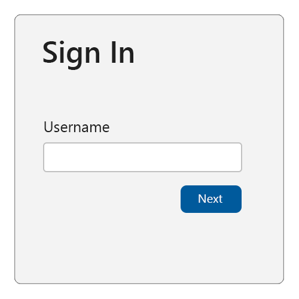

## Authenticating the user

This section applies when the [Relying Party (RP)](/docs/reference/terms/#relying-party-rp) does not yet know who is controlling the client device. There is no browser artifact (such as a cookie or a credential ID in local storage) available to the RP, although for now we assume that the user has an existing account with the RP.

To bootstrap an account, serve the user a sign-in page.

Start off by asking the user for their account identifier, typically a username or email address:



To support the [autofill UI](/docs/reference/terms/#autofill-ui) for passkeys, make sure to:

1. Add the `username` and `webauthn` value to any existing autocomplete annotations on the username input field as shown below in the example.

    ```html
    <div>
      <label for="username">Username:</label>
      <input name="username" id="loginform.username"
             autocomplete="username webauthn">
    </div>
    ```

2. On page load, check to see if autofill UI (conditional mediation) is available using an if statement, then call `navigator.credentials.get()` with `mediation: "conditional"` and `userVerification: "preferred"`.

```html
<script>
  (async () => {
    if (
      typeof window.PublicKeyCredential !== 'undefined'
      && typeof window.PublicKeyCredential.isConditionalMediationAvailable === 'function'
    ) {
      const available = await PublicKeyCredential.isConditionalMediationAvailable();

      if (available) {
        try {
          // Retrieve authentication options for `navigator.credentials.get()`
          // from your server.
          const authOptions = await getAuthenticationOptions();
          // This call to `navigator.credentials.get()` is "set and forget."
          // The Promise will only resolve if the user successfully interacts
          // with the browser's autofill UI to select a passkey.
          const webAuthnResponse = await navigator.credentials.get({
            mediation: "conditional",
            publicKey: {
              ...authOptions,
              // see note about userVerification below
              userVerification: "preferred",
            }
          });
          // Send the response to your server for verification and
          // authenticate the user if the response is valid.
          await verifyAutoFillResponse(webAuthnResponse);
        } catch (err) {
          console.error('Error with conditional UI:', err);
        }
      }
    }
  })();
</script>
```

This will cause the following to happen:

- Retrieve the authentication options from your server. Return at least a random `challenge` and `rpId` to be associated with this authentication request.

- When the user interacts with the username field, the browser and platform will check whether a passkey exists in the platform authenticator that can be used with the relying party. <br><br>If this is the case, the passkey will be presented to the user as an option to choose (along with other credentials that can be auto-filled, such as usernames stored in the browser’s password manager). The browser/platform might render a UI similar to the one shown below, although the exact look and feel will vary from platform to platform (Windows vs. Android vs. iOS), and from form factor to form factor (desktop vs. mobile):


- If the user selects the passkey, the platform UI will guide the user through a (often biometrics-based) user verification check.

- If the user successfully passes the user verification, the `navigator.credentials.get()` succeeds and returns a WebAuthn response.

- If the user selects a credential other than a passkey, the browser/platform chooses a different appropriate action (such as auto-filling the username), and the `navigator.credentials.get()` call does not resolve.

- If the user selects the "Passkey from another device" option (NOTE: the exact text will vary slightly by platform), then the browser/platform will guide the user through using a FIDO2 security key or the  Cross-Device Authentication (CDA) flow to use a passkey from their smartphone or tablet to deliver a WebAuthn response to the `navigator.credentials.get()` call.

- Send the WebAuthn response to your server for verification and additional security checks. If all checks succeed then start an authenticated session for this user.

This is why this is called the Conditional UI (or more commonly, the autofill UI) mode of WebAuthn — the platform authenticator UI that guides the user through the verification, or through using their phone, is only shown if the user has a passkey on this device (or chooses the "another device" option).

As we can see, in this mode the `navigator.credentials.get()` call either succeeds, or it doesn’t (never resolves). If it does succeed, then the result of the call will reveal both a user id, as well as a signed WebAuthn assertion, which the relying party will use to authenticate the user.

If the call doesn’t succeed, perform a "legacy" user authentication: you’ll get a username from this first page, and you then serve appropriate further login challenges (such as passwords, responding to SMS challenges, etc.) to the user in subsequent pages. These may include "account recovery" steps in case the user has forgotten their password or is otherwise not able to pass the regular login challenges. Once the user has passed all the login challenges, they’re considered authenticated and signed in.

What happens when the user doesn’t already have an account with the relying party? Usually, you will give users the option on the sign-in page to create an account. If the user chooses that option, collect the necessary information from the user to open a new account. If the user successfully opens a new account, they’re also considered authenticated and signed-in.

Once the user is signed in, it might be time to set up a new passkey for them. Do this for any of the following cases:

- The user bootstrapped their account on the device by passing non-passkey login challenges (such as using a password).
- The user just created a new account at the relying party, and is considered signed-in because of that.
- The user was using a passkey, but they used a different device than the one they’re currently on (by selecting the "other device" shown in the example above). This can be checked by inspecting the [`authenticatorAttachment`](/) attribute in the returned PublicKeyCredential object.

### A note about user verification

This guidance sets `userVerification` to `preferred`, meaning that user verification will be attempted when possible.

Some devices, such as desktops and older laptops, may not have biometric sensors. On these devices, the user may be asked to enter their system login password for each sign in using a passkey if `userVerification` is set to `required`. This can be a very frustrating user experience to repeat over and over.

When `preferred` is used, some platform authenticators will always require a user verification check when the device has biometric sensors, but may skip user verification on devices without them.

The user verification result (conveyed in [authenticator data flags](https://www.w3.org/TR/2021/REC-webauthn-2-20210408/#flags)) will reflect the actual user verification result and should always be validated against your requirements on the server.

## Opting the user into passkeys

First, verify that the user is sufficiently strongly authenticated using other login methods, including multi-factor authentication.

Second, ensure that the user's device and OS combo supports passkeys by calling:

```js
PublicKeyCredential.isUserVerifyingPlatformAuthenticatorAvailable()
```

If passkeys are supported, this will return `true`. If they aren't supported, this will return `false` and you should abort the passkey enrollment flow.

Serve an opt-in or "upsell" modal/interstitial or page to the user offering them to create a passkey:


If the user has signed in with a passkey from another device (such as a phone, tablet, or FIDO2 security key), you might adjust the wording accordingly:


> Consider showing (or linking to) longer descriptions explaining that all users that are able to unlock the current device will be able to access the account at the relying party to ensure that the user is giving fully informed consent.

If the user consents, call `navigator.credentials.create()`, making sure to ask for a [platform authenticator](/), [user verification preferred](#a-note-about-user-verification), [discoverable credentials](/docs/reference/terms/#discoverable-credential) (formerly known as "resident keys"), and passing an [exclude list](/) of existing passkeys for the account:

```js
navigator.credentials.create({
  publicKey: {
    rp: { ...},
    user: { ...},
    challenge: ...,
    pubKeyCredParams: [
      {
        "type": "public-key",
        "alg": -7 // EC P256
      },
      {
        "type": "public-key",
        "alg": -257 // RSA
      }
    ],
    excludeCredentials: [
      {  // other passkeys (i.e., credentials) tied to the user account
        type: "public-key",
        id: new UInt8Array([21, 31, 56, ...]).buffer,
      },
      {
        type: "public-key",
        id: new UInt8Array([21, 31, 56, ...]).buffer,
      },
      {
        ...
      }
    ],
    authenticatorSelection: {
      residentKey: "required",
      userVerification: "preferred"
    },
    "extensions": {
      "credProps": true
    }
  }
})
```

> A note on attestation: We recommend that most relying parties not specify the attestation conveyance parameter `attestation` (thus defaulting to none), or instead explicitly use the value `indirect`. This guarantees the most streamlined user experience (platforms are likely to obtain consent from the user for other types of attestation conveyances, which likely results in a larger fraction of unsuccessful credential creations due to users canceling the creation).

When the WebAuthn call resolves, send the response to your server and associate the returned public key and credential ID with the previously authenticated user account.
